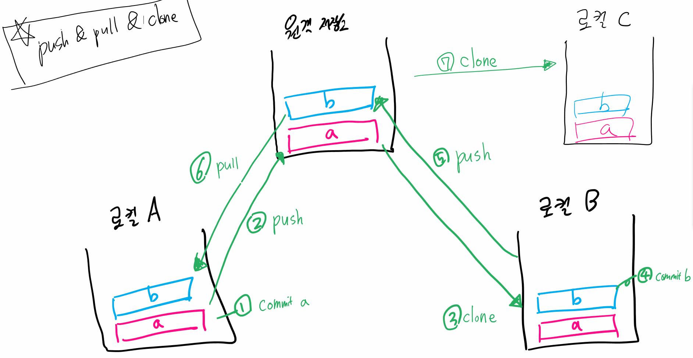

### 3가지 병합 상황

#### 1. fast-forward

> "다른 브랜치가 생성된 이후 master 브랜치에 변경 사항이 없는 상황"
>
> 즉, master 브랜치에서 login 브랜치를 Merge 할 때 
> login 브랜치가 master 브랜치 이후의 커밋을 가리키고 있으면 
> 그저 master 브랜치가 login 브랜치와 동일한 커밋을 가리키도록 이동시킬 뿐
>
> 가장 간단한 과정의 merge

1. login branch 생성 및 이동

   ```bash
   $ git checkout -b login
   ```

2. 특정 작업 완료 후 commit

   ```bash
   $ touch login.txt
   $ git add .
   $ git commit -m "login test 1"
   ```

3. master 브랜치로 이동

   ```bash
   $ git checkout master
   
   $ git log --oneline
   
   * 7a79de3 (login) login test 1
   * 5910361 (HEAD -> master) master test 1
   ```

4. master 에 병합

   ```bash
   $ git merge login
   
   Updating 5910361..7a79de3
   Fast-forward
    login.txt | 0
    1 file changed, 0 insertions(+), 0 deletions(-)
    create mode 100644 login.txt
   ```

5. 결과 확인 (fast-foward, 단순히 HEAD를 이동)

   ```bash
   $ git log --oneline
   
   7a79de3 (HEAD -> master, login) login test 1
   5910361 master test 1
   ```

6. branch 삭제

   ```bash
   $ git branch -d login
   
   $ git log --oneline
   
   7a79de3 (HEAD -> master) login test 1
   5910361 master test 1
   ```

<br>

#### 2. 3-way Merge (Merge commit)

> 현재 브랜치(master)가 가리키는 커밋이 Merge 할 브랜치의 조상이 아니면, 
> git 은 각 브랜치가 가리키는 커밋 2 개와 공통조상 하나를 사용하며 3-way Merge 한다.
>
> 단순히 브랜치 포인터를 최신 커밋으로 옮기는 게 아니라 3-way Merge 의 결과를 
> 별도의 커밋으로 만들고 나서 해당 브랜치가 그 커밋을 가리키도록 이동시킨다. 
> 그래서 이런 커밋은 부모가 여러 개고 Merge commit 이라고 부른다.


1. signout 브랜치 생성 및 이동

   ```bash
   $ git checkout -b signout
   ```

2. 특정 작업 완료 후 commit

   ```bash
   $ touch signout.txt
   
   $ git add .
   $ git commit -m "signout test 1"
   
   $ git log --oneline
   37c8937 (HEAD -> signout) signout test 1
   7a79de3 (master) login test 1
   5910361 master test 1
   ```

3. master 브랜치로 이동

   ```bash
   $ git checkout master
   ```

4. master 에 추가 작업 후 commit (단 **signout 브랜치와 다른 파일**을 생성 혹은 수정)

   ```bash
   $ touch master.txt
   
   $ git add .
   $ git commit -m "master test 2"
   
   $ git log --all --oneline
   5ae736d (HEAD -> master) master test 2
   37c8937 (signout) signout test 1
   7a79de3 login test 1
   5910361 master test 1
   ```

5. master 에 병합

   ```bash
   $ git merge signout
   ```

6. 자동 merge commit 발생

   - 커밋 편집기 화면 등장

   - 자동으로 작성된 커밋 메세지를 확인하고 저장 및 종료

     ```bash
     $ git merge signout
     Merge made by the 'recursive' strategy.
      signout.txt | 0
      1 file changed, 0 insertions(+), 0 deletions(-)
      create mode 100644 signout.txt
     ```

7. log 확인

   ```bash
   $ git log --all --graph --oneline
   *   3ae8333 (HEAD -> master) Merge branch 'signout'
   |\
   | * 37c8937 (signout) signout test 1
   * | 5ae736d master test 2
   |/
   * 7a79de3 login test 1
   * 5910361 master test 1
   ```

8. branch 삭제

   ```bash
   $ git branch -d signout
   ```

<br>

#### 3. Merge Conflict

> Merge 하는 두 브랜치에서 **같은 파일의 한 부분을 동시에 수정**하고 Merge 하면 
> Git은 해당 부분을 자동으로 Merge 하지 못한다. 
> (반면 동일 파일이더라도 서로 다른 부분을 수정했다면, Conflict 없이 자동으로 Merge Commit 된다.)



1. hotfix 브랜치 생성 및 이동

   ```bash
   $ git checkout -b hotfix
   ```

2. 특정 작업 완료 후 commit

   ```bash
   # test.txt 수정
   
   master test 1
   이건 hotfix 에서 작성한
   문장이에요!!
   ```

   ```bash
   $ git add .
   $ git commit -m "hotfix test 1"
   
   $ git log --graph --oneline
   * 1a12012 (HEAD -> hotfix) hotfix test 1
   *   3ae8333 (master) Merge branch 'signout'
   |\
   | * 37c8937 signout test 1
   * | 5ae736d master test 2
   |/
   * 7a79de3 login test 1
   * 5910361 master test 1
   ```

3. master 브랜치로 이동

   ```bash
   $ git checkout master
   ```

4. 특정 작업(hotfix 와 동일 파일의 동일 부분 수정) 완료 후 commit

   ```bash
   # text.txt 수정
   
   master test 1
   이건 master 에서 작성한
   코드에용ㅎㅎ!!
   ```

   ```bash
   $ git add .
   $ git commit -m "master test 3"
   
   $ git log --graph --oneline --all
   * ac05762 (HEAD -> master) master test 3
   | * 1a12012 (hotfix) hotfix test 1
   |/
   *   3ae8333 Merge branch 'signout'
   |\
   | * 37c8937 signout test 1
   * | 5ae736d master test 2
   |/
   * 7a79de3 login test 1
   * 5910361 master test 1
   ```

5. master 에 병합

   ```bash
   $ git merge hotfix
   ```

6. 결과 → `merge conflict` 발생

7. 충돌 확인 및 해결

   - Merge 충돌이 일어났을 때 Git이 어떤 파일을 Merge 할 수 없었는지 살펴보려면 git status 명령을 이용한다.

   ```bash
   $ git status
   On branch master
   You have unmerged paths.
     (fix conflicts and run "git commit")
     (use "git merge --abort" to abort the merge)
   
   Unmerged paths:
     (use "git add <file>..." to mark resolution)
   
           both modified:   test.txt
   
   no changes added to commit (use "git add" and/or "git commit -a")
   ```

   ```
   master test 1
   <<<<<<< HEAD
   이건 master 에서 작성한
   코드에용ㅎㅎ!!
   =======
   이건 hotfix 에서 작성한
   문장이에요!!
   >>>>>>> hotfix
   ```

   - `=======` 위쪽의 내용은 HEAD 버전(merge 명령을 실행할 때 작업하던 master 브랜치)의 내용이고 아래쪽은 `hotfix` 브랜치의 내용이다. 충돌을 해결하려면 위쪽이나 아래쪽 내용 중에서 고르거나 새로 작성하여 Merge 한다. (`<<<<<<<, =======, >>>>>>>` 가 포함된 행을 삭제)

   ```bash
   # test.txt 최종본
   
   master test 1
   충돌을
   해결해보자!!
   ```

8. merge commit 진행

   ```bash
   $ git add .
   $ git commit
   ```

   - 이전에 진행했던 커밋 편집기 재등장

     ```bash
     Merge branch 'hotfix'
     
     # Conflicts:
     #       test.txt
     #
     # It looks like you may be committing a merge.
     # If this is not correct, please remove the file
     #       .git/MERGE_HEAD
     # and try again.
     
     # Please enter the commit message for your changes. Lines starting
     # with '#' will be ignored, and an empty message aborts the commit.
     #
     # On branch master
     # All conflicts fixed but you are still merging.
     #
     # Changes to be committed:
     #       modified:   test.txt
     #
     ```

     - 자동으로 작성된 커밋 메세지를 확인하고 저장 및 종료

       ```bash
       $ git commit
       [master 2aa2b1e] Merge branch 'hotfix'
       ```

9. log 확인

   ```bash
   $ git log --all --graph --oneline
   *   2aa2b1e (HEAD -> master) Merge branch 'hotfix'
   |\
   | * 1a12012 (hotfix) hotfix test 1
   * | ac05762 master test 3
   |/
   *   3ae8333 Merge branch 'signout'
   |\
   | * 37c8937 signout test 1
   * | 5ae736d master test 2
   |/
   * 7a79de3 login test 1
   * 5910361 master test 1
   ```

10. 브랜치 삭제

    ```bash
    $ git branch -d hotfix
    ```


